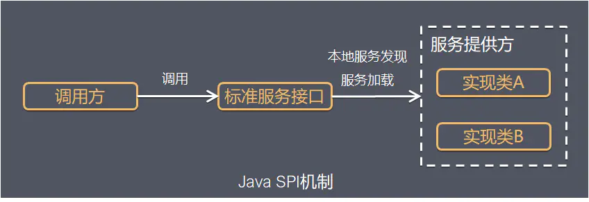

# SPI

### SPI介绍

SPI全称Service Provider Interface，是Java提供的一套用来被第三方实现或者扩展的API，它可以用来启用框架扩展和替换组件，是JDK内置的一种动态扩展点的实现。



Java SPI 实际上是“**基于接口的编程＋策略模式＋配置文件**”组合实现的动态加载机制。

SPI提供为某个接口寻找服务实现的机制。

#### SPI的不足

1. 不能按需加载，需要遍历所有的实现，并实例化，然后在循环中才能找到我们需要的实现。如果不想用某些实现类，或者某些类实例化很耗时，它也被载入并实例化了，这就造成了浪费。

2. 获取某个实现类的方式不够灵活，只能通过 Iterator 形式获取，不能根据某个参数来获取对应的实现类。（Spring 的BeanFactory，ApplicationContext 就要高级一些了。）

3. 多个并发多线程使用 ServiceLoader 类的实例是不安全的。

### 使用场景

概括地说，适用于：**调用者根据实际使用需要，启用、扩展、或者替换框架的实现策略**

比较常见的例子：

- 数据库驱动加载接口实现类的加载
     JDBC加载不同类型数据库的驱动
- 日志门面接口实现类加载
     SLF4J加载不同提供商的日志实现类
- Spring
     Spring中大量使用了SPI,比如：对servlet3.0规范对ServletContainerInitializer的实现、自动类型转换Type Conversion SPI(Converter SPI、Formatter SPI)等
- Dubbo
     Dubbo中也大量使用SPI的方式实现框架的扩展, 不过它对Java提供的原生SPI做了封装，允许用户扩展实现Filter接口

### 使用介绍

要使用Java SPI，需要遵循如下约定：

1. 当服务提供者提供了接口的一种具体实现后，在jar包的META-INF/services目录下创建一个以“接口全限定名”为命名的文件，内容为实现类的全限定名；

2. 接口实现类所在的jar包放在主程序的classpath中；

3. 主程序通过java.util.ServiceLoder动态装载实现模块，它通过扫描META-INF/services目录下的配置文件找到实现类的全限定名，把类加载到JVM；

4. SPI的实现类必须携带一个不带参数的构造方法；

### 示例代码

#### 1. 定义接口和实现

```java
public interface IShout {
    void shout();
}

public class Cat implements IShout {
    @Override
    public void shout() {
        System.out.println("miao miao");
    }
}

public class Dog implements IShout {
    @Override
    public void shout() {
        System.out.println("wang wang");
    }
}
```

#### 2. 创建以接口命名的文件

在 `src/main/resources` 下建立 `META-INF/services` 目录，新增一个以接口命名的文件：

```
- src
    -main
        -resources
            - META-INF
                - services
                    - org.foo.demo.IShout
```

```java
org.foo.demo.animal.Dog
org.foo.demo.animal.Cat
```

#### 3. 使用 ServiceLoader 加载实现

```java
public class Main {
    public static void main(String[] args) {
        ServiceLoader<IShout> shouts = ServiceLoader.load(IShout.class);
        for (IShout s : shouts) {
            s.shout();
        }
    }
}
```

### 原理解析

首先，ServiceLoader实现了Iterable接口，所以它有迭代器的属性，这里主要都是实现了迭代器的hasNext和next方法。这里主要都是调用的lookupIterator的相应hasNext和next方法，lookupIterator是懒加载迭代器。

其次，LazyIterator中的hasNext方法，静态变量PREFIX就是”META-INF/services/”目录，这也就是为什么需要在classpath下的META-INF/services/目录里创建一个以服务接口命名的文件。

最后，通过反射方法Class.forName()加载类对象，并用newInstance方法将类实例化，并把实例化后的类缓存到providers对象中，(LinkedHashMap<String,S>类型） 然后返回实例对象。


```java
package java.util;

import java.io.BufferedReader;
import java.io.IOException;
import java.io.InputStream;
import java.io.InputStreamReader;
import java.net.URL;
import java.security.AccessController;
import java.security.AccessControlContext;
import java.security.PrivilegedAction;
import java.util.ArrayList;
import java.util.Enumeration;
import java.util.Iterator;
import java.util.List;
import java.util.NoSuchElementException;

// ServiceLoader实现了Iterable接口，可以遍历所有的服务实现者
public final class ServiceLoader<S> implements Iterable<S>
{

    // 约定的配置文件的存放目录
    private static final String PREFIX = "META-INF/services/";

    // The class or interface representing the service being loaded
    private final Class<S> service;

    // The class loader used to locate, load, and instantiate providers
    private final ClassLoader loader;

    // The access control context taken when the ServiceLoader is created
    private final AccessControlContext acc;

    // Cached providers, in instantiation order
    private LinkedHashMap<String,S> providers = new LinkedHashMap<>();

    // The current lazy-lookup iterator
    private LazyIterator lookupIterator;

    /**
     * Clear this loader's provider cache so that all providers will be
     * reloaded.
     *
     * <p> After invoking this method, subsequent invocations of the {@link
     * #iterator() iterator} method will lazily look up and instantiate
     * providers from scratch, just as is done by a newly-created loader.
     *
     * <p> This method is intended for use in situations in which new providers
     * can be installed into a running Java virtual machine.
     */
    public void reload() {
        providers.clear();
        lookupIterator = new LazyIterator(service, loader);
    }

    private ServiceLoader(Class<S> svc, ClassLoader cl) {
        service = Objects.requireNonNull(svc, "Service interface cannot be null");
        loader = (cl == null) ? ClassLoader.getSystemClassLoader() : cl;
        acc = (System.getSecurityManager() != null) ? AccessController.getContext() : null;
        reload();
    }

    private static void fail(Class<?> service, String msg, Throwable cause)
        throws ServiceConfigurationError
    {
        throw new ServiceConfigurationError(service.getName() + ": " + msg,
                                            cause);
    }

    private static void fail(Class<?> service, String msg)
        throws ServiceConfigurationError
    {
        throw new ServiceConfigurationError(service.getName() + ": " + msg);
    }

    private static void fail(Class<?> service, URL u, int line, String msg)
        throws ServiceConfigurationError
    {
        fail(service, u + ":" + line + ": " + msg);
    }

    // Parse a single line from the given configuration file, adding the name
    // on the line to the names list.
    //
    private int parseLine(Class<?> service, URL u, BufferedReader r, int lc,
                          List<String> names)
        throws IOException, ServiceConfigurationError
    {
        String ln = r.readLine();
        if (ln == null) {
            return -1;
        }
        int ci = ln.indexOf('#');
        if (ci >= 0) ln = ln.substring(0, ci);
        ln = ln.trim();
        int n = ln.length();
        if (n != 0) {
            if ((ln.indexOf(' ') >= 0) || (ln.indexOf('\t') >= 0))
                fail(service, u, lc, "Illegal configuration-file syntax");
            int cp = ln.codePointAt(0);
            if (!Character.isJavaIdentifierStart(cp))
                fail(service, u, lc, "Illegal provider-class name: " + ln);
            for (int i = Character.charCount(cp); i < n; i += Character.charCount(cp)) {
                cp = ln.codePointAt(i);
                if (!Character.isJavaIdentifierPart(cp) && (cp != '.'))
                    fail(service, u, lc, "Illegal provider-class name: " + ln);
            }
            if (!providers.containsKey(ln) && !names.contains(ln))
                names.add(ln);
        }
        return lc + 1;
    }

    // Parse the content of the given URL as a provider-configuration file.
    //
    // @param  service
    //         The service type for which providers are being sought;
    //         used to construct error detail strings
    //
    // @param  u
    //         The URL naming the configuration file to be parsed
    //
    // @return A (possibly empty) iterator that will yield the provider-class
    //         names in the given configuration file that are not yet members
    //         of the returned set
    //
    // @throws ServiceConfigurationError
    //         If an I/O error occurs while reading from the given URL, or
    //         if a configuration-file format error is detected
    //
    private Iterator<String> parse(Class<?> service, URL u)
        throws ServiceConfigurationError
    {
        InputStream in = null;
        BufferedReader r = null;
        ArrayList<String> names = new ArrayList<>();
        try {
            in = u.openStream();
            r = new BufferedReader(new InputStreamReader(in, "utf-8"));
            int lc = 1;
            while ((lc = parseLine(service, u, r, lc, names)) >= 0);
        } catch (IOException x) {
            fail(service, "Error reading configuration file", x);
        } finally {
            try {
                if (r != null) r.close();
                if (in != null) in.close();
            } catch (IOException y) {
                fail(service, "Error closing configuration file", y);
            }
        }
        return names.iterator();
    }

    // Private inner class implementing fully-lazy provider lookup
    //
    private class LazyIterator
        implements Iterator<S>
    {

        Class<S> service;
        ClassLoader loader;
        Enumeration<URL> configs = null;
        Iterator<String> pending = null;
        String nextName = null;

        private LazyIterator(Class<S> service, ClassLoader loader) {
            this.service = service;
            this.loader = loader;
        }

        private boolean hasNextService() {
            if (nextName != null) {
                return true;
            }
            if (configs == null) {
                try {
                    String fullName = PREFIX + service.getName();
                    if (loader == null)
                        configs = ClassLoader.getSystemResources(fullName);
                    else
                        configs = loader.getResources(fullName);
                } catch (IOException x) {
                    fail(service, "Error locating configuration files", x);
                }
            }
            while ((pending == null) || !pending.hasNext()) {
                if (!configs.hasMoreElements()) {
                    return false;
                }
                pending = parse(service, configs.nextElement());
            }
            nextName = pending.next();
            return true;
        }

        private S nextService() {
            if (!hasNextService())
                throw new NoSuchElementException();
            String cn = nextName;
            nextName = null;
            Class<?> c = null;
            try {
                c = Class.forName(cn, false, loader);
            } catch (ClassNotFoundException x) {
                fail(service,
                     "Provider " + cn + " not found");
            }
            if (!service.isAssignableFrom(c)) {
                fail(service,
                     "Provider " + cn  + " not a subtype");
            }
            try {
                // 用反射机制，创建接口实现对象
                S p = service.cast(c.newInstance());
               // 放进 ServiceLoader的providers容器里面
                providers.put(cn, p);
                return p;
            } catch (Throwable x) {
                fail(service,
                     "Provider " + cn + " could not be instantiated",
                     x);
            }
            throw new Error();          // This cannot happen
        }

        public boolean hasNext() {
            if (acc == null) {
                return hasNextService();
            } else {
                PrivilegedAction<Boolean> action = new PrivilegedAction<Boolean>() {
                    public Boolean run() { return hasNextService(); }
                };
                return AccessController.doPrivileged(action, acc);
            }
        }

        public S next() {
            if (acc == null) {
                return nextService();
            } else {
                PrivilegedAction<S> action = new PrivilegedAction<S>() {
                    public S run() { return nextService(); }
                };
                return AccessController.doPrivileged(action, acc);
            }
        }

        public void remove() {
            throw new UnsupportedOperationException();
        }

    }

    /**
     * Lazily loads the available providers of this loader's service.
     *
     * <p> The iterator returned by this method first yields all of the
     * elements of the provider cache, in instantiation order.  It then lazily
     * loads and instantiates any remaining providers, adding each one to the
     * cache in turn.
     *
     * <p> To achieve laziness the actual work of parsing the available
     * provider-configuration files and instantiating providers must be done by
     * the iterator itself.  Its {@link java.util.Iterator#hasNext hasNext} and
     * {@link java.util.Iterator#next next} methods can therefore throw a
     * {@link ServiceConfigurationError} if a provider-configuration file
     * violates the specified format, or if it names a provider class that
     * cannot be found and instantiated, or if the result of instantiating the
     * class is not assignable to the service type, or if any other kind of
     * exception or error is thrown as the next provider is located and
     * instantiated.  To write robust code it is only necessary to catch {@link
     * ServiceConfigurationError} when using a service iterator.
     *
     * <p> If such an error is thrown then subsequent invocations of the
     * iterator will make a best effort to locate and instantiate the next
     * available provider, but in general such recovery cannot be guaranteed.
     *
     * <blockquote style="font-size: smaller; line-height: 1.2"><span
     * style="padding-right: 1em; font-weight: bold">Design Note</span>
     * Throwing an error in these cases may seem extreme.  The rationale for
     * this behavior is that a malformed provider-configuration file, like a
     * malformed class file, indicates a serious problem with the way the Java
     * virtual machine is configured or is being used.  As such it is
     * preferable to throw an error rather than try to recover or, even worse,
     * fail silently.</blockquote>
     *
     * <p> The iterator returned by this method does not support removal.
     * Invoking its {@link java.util.Iterator#remove() remove} method will
     * cause an {@link UnsupportedOperationException} to be thrown.
     *
     * @implNote When adding providers to the cache, the {@link #iterator
     * Iterator} processes resources in the order that the {@link
     * java.lang.ClassLoader#getResources(java.lang.String)
     * ClassLoader.getResources(String)} method finds the service configuration
     * files.
     *
     * @return  An iterator that lazily loads providers for this loader's
     *          service
     */
    public Iterator<S> iterator() {
        return new Iterator<S>() {

            Iterator<Map.Entry<String,S>> knownProviders
                = providers.entrySet().iterator();

            public boolean hasNext() {
                if (knownProviders.hasNext())
                    return true;
                return lookupIterator.hasNext();
            }

            public S next() {
                if (knownProviders.hasNext())
                    return knownProviders.next().getValue();
                return lookupIterator.next();
            }

            public void remove() {
                throw new UnsupportedOperationException();
            }

        };
    }

    /**
     * Creates a new service loader for the given service type and class
     * loader.
     *
     * @param  <S> the class of the service type
     *
     * @param  service
     *         The interface or abstract class representing the service
     *
     * @param  loader
     *         The class loader to be used to load provider-configuration files
     *         and provider classes, or <tt>null</tt> if the system class
     *         loader (or, failing that, the bootstrap class loader) is to be
     *         used
     *
     * @return A new service loader
     */
    public static <S> ServiceLoader<S> load(Class<S> service,
                                            ClassLoader loader)
    {
        return new ServiceLoader<>(service, loader);
    }

    /**
     * Creates a new service loader for the given service type, using the
     * current thread's {@linkplain java.lang.Thread#getContextClassLoader
     * context class loader}.
     *
     * <p> An invocation of this convenience method of the form
     *
     * <blockquote><pre>
     * ServiceLoader.load(<i>service</i>)</pre></blockquote>
     *
     * is equivalent to
     *
     * <blockquote><pre>
     * ServiceLoader.load(<i>service</i>,
     *                    Thread.currentThread().getContextClassLoader())</pre></blockquote>
     *
     * @param  <S> the class of the service type
     *
     * @param  service
     *         The interface or abstract class representing the service
     *
     * @return A new service loader
     */
    public static <S> ServiceLoader<S> load(Class<S> service) {
        ClassLoader cl = Thread.currentThread().getContextClassLoader();
        return ServiceLoader.load(service, cl);
    }

    /**
     * Creates a new service loader for the given service type, using the
     * extension class loader.
     *
     * <p> This convenience method simply locates the extension class loader,
     * call it <tt><i>extClassLoader</i></tt>, and then returns
     *
     * <blockquote><pre>
     * ServiceLoader.load(<i>service</i>, <i>extClassLoader</i>)</pre></blockquote>
     *
     * <p> If the extension class loader cannot be found then the system class
     * loader is used; if there is no system class loader then the bootstrap
     * class loader is used.
     *
     * <p> This method is intended for use when only installed providers are
     * desired.  The resulting service will only find and load providers that
     * have been installed into the current Java virtual machine; providers on
     * the application's class path will be ignored.
     *
     * @param  <S> the class of the service type
     *
     * @param  service
     *         The interface or abstract class representing the service
     *
     * @return A new service loader
     */
    public static <S> ServiceLoader<S> loadInstalled(Class<S> service) {
        ClassLoader cl = ClassLoader.getSystemClassLoader();
        ClassLoader prev = null;
        while (cl != null) {
            prev = cl;
            cl = cl.getParent();
        }
        return ServiceLoader.load(service, prev);
    }

    /**
     * Returns a string describing this service.
     *
     * @return  A descriptive string
     */
    public String toString() {
        return "java.util.ServiceLoader[" + service.getName() + "]";
    }

}
```

